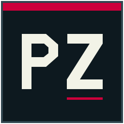
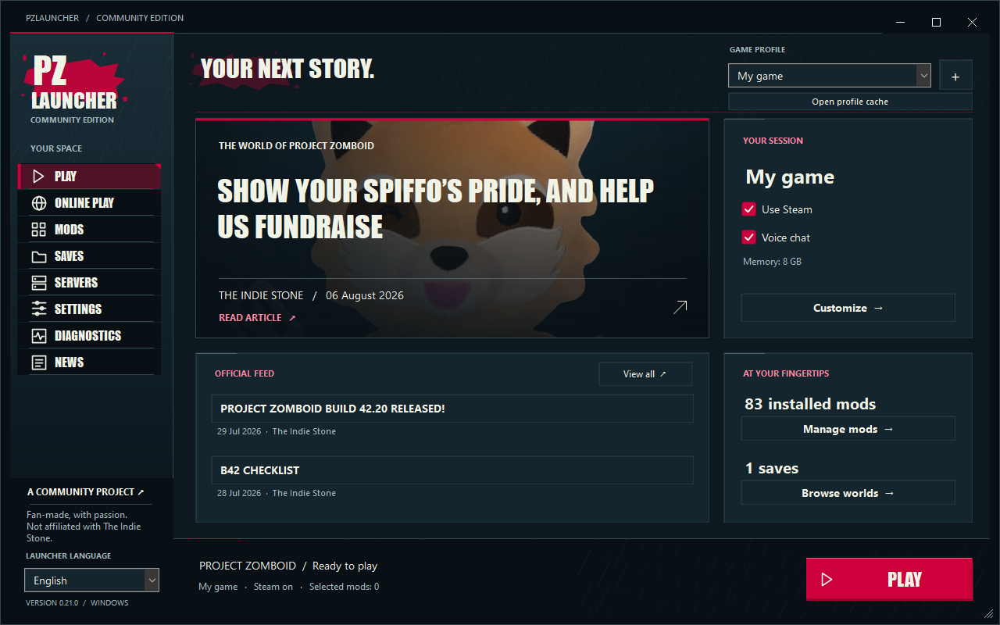

<p align="center">
  
</p>

<h1 align="center">PZLauncher Community</h1>

<p align="center">
  A desktop launcher and management toolkit for Project Zomboid Build 42 on Windows.
</p>

<p align="center">
  <strong>Profiles</strong> · <strong>Mods</strong> · <strong>Online servers</strong> · <strong>Dedicated hosting</strong> · <strong>World tools</strong> · <strong>Java loaders</strong>
</p>



<sub>The interface is PZLauncher Community. News artwork visible in the screenshot comes from the official Project Zomboid feed and remains the property of The Indie Stone.</sub>

PZLauncher Community brings client launch profiles, mod management, public server discovery, dedicated server administration, save tools and diagnostics into one native Windows application. It uses the Java runtime included with an installed copy of Project Zomboid and keeps launcher data separate from the game installation.

> PZLauncher is an independent community project. It is not affiliated with or endorsed by The Indie Stone.

> AI was used as a support tool for documentation, translations into languages I do not speak, and testing. This application also brings together many of my existing Project Zomboid tools, with retained project files dating back to January 2022—well before AI-assisted coding became part of my workflow. This is not an AI-generated project, but a long-running personal codebase enhanced with AI support.

> Also include part of my old projects
> Project	Oldest date
> PZ_ServerModsManager	2022-01-06
> PZ_MapGen	2022-01-07
> PZ_MapMover	2022-01-26
> PZ_VHSMaker	2022-02-05
> PZ_ZombieLayerReplacer	2022-02-22
> PZ_MoveMap	2022-02-22
> PZ_ChunkWiper	2022-03-11
> PZ_Trad	2022-06-13
> PZ_Mapper	2023-01-13
> PZ_BuildingGenerator	2024-04-12
> PZ_BiomeMap_Generator	2025-06-15
> PZ_Mapper_Converter	2026-05-24


## Features

### Game profiles and launch control

- Independent profiles with dedicated cache directories, Steam or GOG mode and launch options.
- Automatic hardware-aware JVM recommendations or fully manual heap, collector, stack and advanced argument control.
- Steam, GOG and custom installation discovery with explicit version selection.
- Concurrent client and dedicated-server launch, including existing setups that share the standard PZ cache.

### Mods and Java loaders

- Traditional mod discovery, enablement, dependency resolution and stable load-order validation.
- SteamCMD Workshop downloads with validation, cancellation and managed local copies.
- Client and server support for the built-in PZLauncher Java API, Leaf, ZombieBuddy and direct classpath JARs.
- Side-aware Java mod checks, isolated preflight validation and runtime-pack integrity verification.

### Online and dedicated servers

- Progressive public-server browser with filters, details, favorites, ping and advertised statistics.
- Optional mod-list capture through a short-lived game connection that stops before character loading.
- Dedicated server configuration forms, raw INI/Lua editing, live console and clean shutdown commands.
- Linked client profiles, separate caches, synchronized runtime packs, atomic replacement and rollback.
- Exportable Windows and Linux server launch bundles.

### Worlds, saves and diagnostics

- World backup and restore with SQLite-aware snapshots.
- Save inspection, supported world-setting edits, database browsing and recoverable deletion.
- Chunk-wipe preview and execution with automatic backup and quarantined files.
- Detachable world map viewer with image/GIF backgrounds, scale calibration and cell selection.
- FTP/FTPS working copies with resumable downloads, conflict checks, reviewed uploads and retained remote backups.
- Console analysis with grouped errors, stack context, mod attribution and navigation markers.

### Interface and localization

- Custom dark WinForms interface inspired by the atmosphere of Project Zomboid.
- English, French, Spanish, German, Russian, Brazilian Portuguese and Simplified Chinese included.
- Versioned JSON language packs for community translations.
- DPI-aware custom window chrome and responsive layouts.

## Download and run

Download the self-contained Windows x64 build from the repository's [Releases](../../releases) page, extract it to a writable directory and open `PZLauncher.exe`.

Project Zomboid must already be installed. On first launch, choose the Steam, GOG or custom installation in **Settings**. Profiles, server caches and launcher settings are stored outside the installation; the folder buttons in the interface show their exact locations.

The self-contained release includes .NET. The lightweight release requires the [.NET 10 Desktop Runtime x64](https://dotnet.microsoft.com/download/dotnet/10.0). Both use Project Zomboid's bundled Java runtime when starting the game or server.

## Build from source

Requirements:

- Windows x64
- PowerShell 7
- .NET 10 SDK
- JDK 25
- An installed Build 42 copy of Project Zomboid for the full verification suite

```powershell
./build.ps1 -JavaHome 'C:\Path\To\jdk-25'
```

The default build creates a self-contained release in `dist`. Add `-Light` for the runtime-dependent build in `dist-light`, or `-OutputDirectory` to choose another output directory. Generated builds and verification artifacts are intentionally excluded from Git.

Run the complete isolated verification suite during a release build:

```powershell
$previousData = $env:PZLAUNCHER_DATA
try {
    $env:PZLAUNCHER_DATA = Join-Path $PWD 'artifacts/verification-data'
    ./build.ps1 -JavaHome 'C:\Path\To\jdk-25' -Verify
} finally {
    $env:PZLAUNCHER_DATA = $previousData
}
```

Verify the Java loader independently:

```powershell
./java-loader/verify.ps1 `
    -JavaHome 'C:\Path\To\jdk-25' `
    -RuntimeJava 'C:\Path\To\ProjectZomboid\jre64\bin\java.exe'
```

Network probes and real client/server smoke tests are opt-in. Review their parameters before running them. The launcher never needs to modify the Project Zomboid installation for normal profile, server or world management.

## Documentation

- [English user guide](docs/USER_GUIDE.md)
- [Guide utilisateur français](docs/GUIDE_UTILISATEUR.md)
- [Community language packs](docs/LANGUAGE_PACKS.md)
- [Java loader API](docs/JAVA_LOADER.md)
- [Technical documentation index](docs/README.md)
- [Imported code provenance](PZLauncher/PZLauncher/Imported/ChunkWiper/PROVENANCE.md)

Offline HTML guides are generated with the application theme during release builds. They are published beside the executable as `START-HERE.html`, `USER-GUIDE.html` and `GUIDE-UTILISATEUR.html`.

## Repository layout

| Path | Purpose |
|---|---|
| `PZLauncher/PZLauncher` | .NET 10 WinForms application |
| `java-loader` | Java 25 loader, probe and configuration inspector |
| `docs` | User, contributor and technical documentation |
| `scripts` | Build, publishing and opt-in verification tools |
| `PZ_ServerModsManager` | Preserved legacy source used during the project's evolution |

## License and credits

PZLauncher Community is licensed under the [GNU General Public License v3.0 only](LICENSE). Covered modifications and derivative works that are distributed must preserve the license and notices, provide their corresponding source code and remain under GPL‑3.0-only.

Project authorship and imported-code provenance are recorded in [NOTICE.md](NOTICE.md). Dependency licenses and external-project acknowledgements are recorded in [THIRD_PARTY_NOTICES.md](THIRD_PARTY_NOTICES.md). Project Zomboid, its name and its assets belong to their respective owners.
